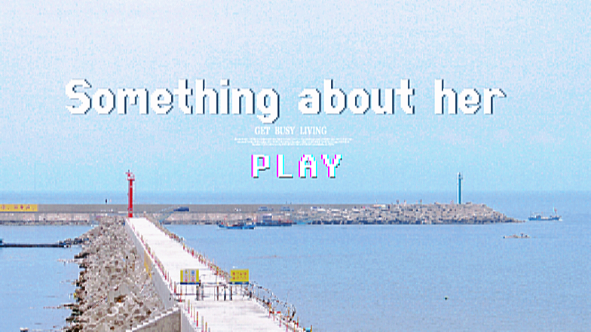

# Welcome! 
---

## START
{: .center-img}

???+ note "正在学习"
    - TOEFL   
    - 静态网站搭建
    - sql
    - 日本語
    - 한극어

???+ tip "七日待办" 
    - [x] 生理心理学课程论文 
    - [x] 字节面试0626-22:30
    - [x] 六年级英语培优0626-20:00
    - [ ] 初一英语培优0628-17:00

???+ inline tip "MONTHLY"
    - [ ] 话剧《温暖的味道》 7.25南京
    
???+ inline tip "YEAR 2025"
    - [ ] 网站

"未来还是不确定，但已经完全从我的过去和我的自我之中解脱出来了。……这就好像我可以重新再来似的：没有快乐也没有更不幸。但多了对自己的力量认识、对虚荣心的唾弃，以及这份清醒的、催着我去面对自己生命的狂热。"

## Bugs & Enhancements

=== "existing bugs"
    - [x] 无法进入网页
    - [x] 评论显示错误
    - [x] 嵌套列表不显示
    - [x] 图片在safari不显示
    - [x] 中文字体不显示
    - [ ] 行文页面过宽--设置右导航栏固定内容
    - [x] gh-pages 无法自动部署
    - [ ] 所有表格无法同宽

=== "Enhancements"
    - [x] 封面自定义
    - [x] icon自定义
    - [ ] UI美化
    - [ ] 插件
    - [ ] 代码高亮
    - [ ] 想要做出纸页的效果
    - [ ] 折叠
 

## Expecting Content
- [ ] zotere
- [ ] github.io website
- [ ] 高中语文