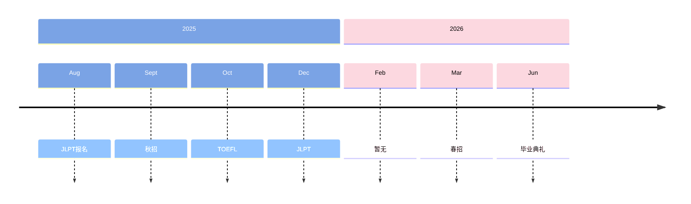

## New ip
记录一些去过的地方。

=== "潮汕地区"  
    去了汕头、南澳、潮州。   
    两大特点：  
        1.真的好吃！！！  
        2.太湿热了无法呼吸，狂中暑。  
    为了牛肉火锅、烤肉、肠粉、粿条、虾饺、凤爪、金钱肚、香芋排骨、腐乳鸡翅……我愿意再去一次……饿了…… 
    正宗的顺德双皮奶，口感是黏腻的腥甜，果然我还是习惯喝工业泡粉的吧。  

=== "济州岛"  
    热。 
    通勤好久好久。 
    喜欢海。 
    咖啡好喝。 

=== "苏州"
    去了拙政园、平江路、山塘街。 
    园林固然美，游客太多，已经失去那种雅致的幽趣。 

=== "常州"
    这里居然与苏轼极有渊源。

=== "上海"
    在这块究极繁华之地，也有老破小。

=== "柘荣"  
    不知道为什么突然想起了柘荣，想起小时候路过，主街道两侧高大的枫树，每一棵都有两三人合围那么粗。  
    夏天，蓊郁的绿荫笼盖长街。枝条肆意伸张，枫叶宽大，交错重叠。由于烈日的照射，从底下看，绿得深深浅浅。树叶子上的脉络，几近透明。镂空的罅隙中，洒下来光的斑点。   
    好久没有见过这样遮天蔽日的行道树了。

## Milestones
