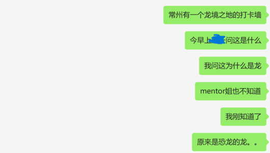
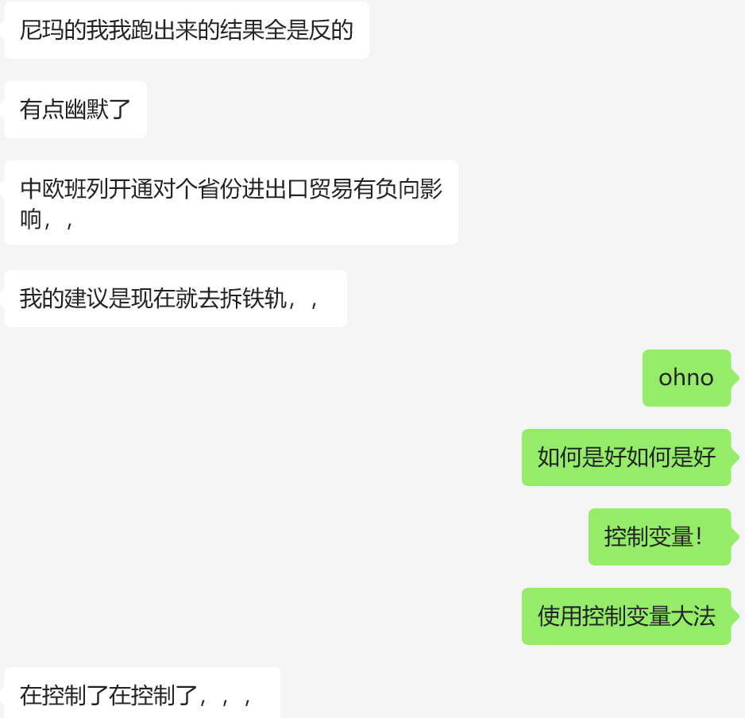
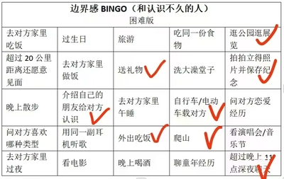

一些聊天记录

## 抽象病房
!!! question ""   
    
---
!!! question ""
    

## 深夜播客

---  
!!! question ""
      
    
    友1：出门这个东西 就已经 是很 那个的事情了  
    俺：这很正常啊。。。   
    友1：两个人单独吗 这很不正常了   
    俺：哪里不正常了。。  
    友1：这是多么亲密的一件事。。。    
    友2：我个人觉得还好。。  
    友2：但确实有的人会介意吧  
    俺：男女大防。。  
    友2：那如果是同性恋该如何自处  
    俺：笑死我  伪装顺直（）  
    友2：弯直大防。。  
    ---
    俺：我好像突然意识到别人为什么会觉得我高冷了。。。  
    友：为什么呢  
    俺：因为别人以为和我进行了比较亲近的事，在我看来就是普通距离，人以为我们关系应该变近了，但我其实还是保持普通距离  
    友1：我还以为是看着显凶  
    友3：我还以为是看着显凶  
    俺：也有这个因素吧（）但我跟别人讲话都是笑着的。。  
    友1：确实是这样  你给我的 经常很无情的 这种感觉  
    友1：好像真的是  
    ---  
    俺：我还是去尼姑庵吧  
    友：嗯呢  
    俺：两个极端  一夜情和尼姑庵  
    友：你适合普渡众生  
    俺：周一三五尼姑庵 周二四六一夜情 周日向佛祖忏悔  
    友：啊啊啊啊啊啊啊啊啊  
    【宇宙免责声明：没有任何不敬的意思，没有任何进行危险x行为的意思，纯段子】  

    

    

