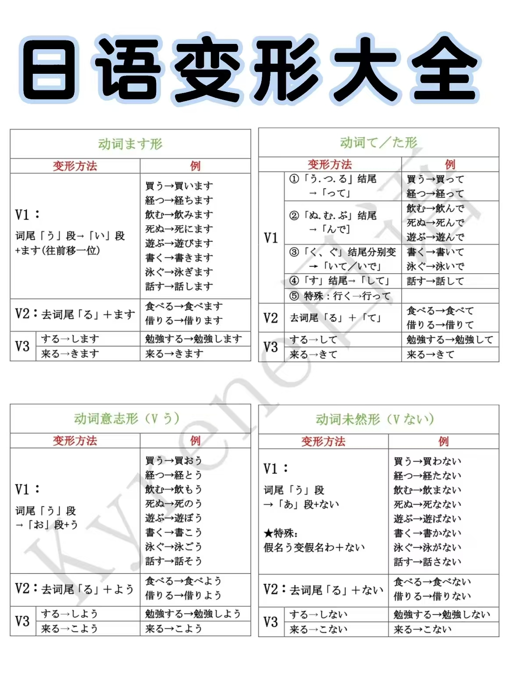
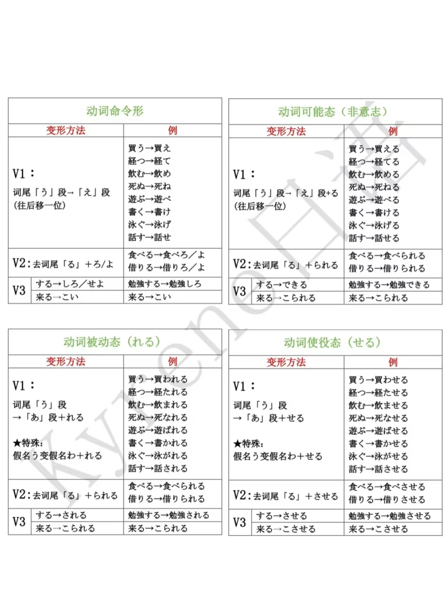
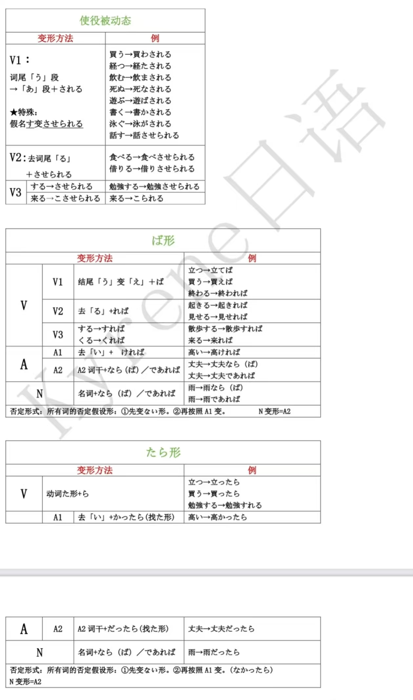

目标：N2； 计划周期：xx；  

据说600个小时就能学到N2，∑(〟OОO)真…真的吗!?  
## 学习进度追踪
貌似需要刷新才能看全↓  

  

    <h3>日语学习进度 0/600 小时</h3>
    

      <button class="add-hour">+1小时</button>
      <button class="undo-hour">-1小时</button>
      <button class="reset-all">重置</button>
    

  

  

  

    <small>最后更新: 尚未记录</small>
  

## Resources
1. [hero3046老师，主页有非常齐全的初级到中级课程、考前复习、蓝宝书系列，教材为《新日本语教程》](https://space.bilibili.com/65988295?spm_id_from=333.337.0.0)
2. [周业繁老师，教材为《大家的日本语》，速度较快](https://space.bilibili.com/137798711?spm_id_from=333.337.0.0)
3. [搭建整体语法体系](https://space.bilibili.com/14371394?spm_id_from=333.337.0.0)

教材：新标日；大家的日本语  
练习：50天逐级突破单词天天背； 50天逐级突破阅读天天做  

## Pronunciation
1. 长音：あ＋あ＝アー　　い＋い＝イー　　う＋う＝ウー　　え＋え＝エー  　**え＋い＝エー**　お＋お＝オー　**お＋う＝オー**  
2. 拨音：ん  
3. 促音：っ  
4. 音调： 

| 音调数字 | 声调变化 |
| :---: | --- |
| ⓪ | 第一个音节低，后面的音节都是高音 |
| ① | 第一个音节高，后面的音节都是低音 |
| ② | 第一个音节低，第二个音节高，后面是低音 |
| ③ | 第一个音节低，第二、三个音节高，后面是低音 |
| ④ | 第一个音节低，第二到四个音节高，后面是低音 |
| ... | ... |

## Grammar
1. 名词谓语的肯定式： 名は　名です。  
2. 名词谓语的否定式：　名は　名では「じゃ」ありません「ないです」。　
3. 名词谓语的疑问句式：　名は　名ですか。  
4. 美化词表尊敬： お＋名（多为训读）　／　ご＋名（多为音读） 
5. の的用法： 名词的连体形 名の名； 表所属所有； 电话番号中间的连接号-    
6. 时间/地点+から Bまで　从A开始到B结束；  　

### Deformation

## Others

### 姓氏表
| 　姓名　| 发音　|
| :---:  | :---: |
| 佐藤　|　さとう②　|
| 木村　| きむら　|
|　小野　| おの　|
|　キム　| きむ　|
|　王　| おう　|　
|　　　| 　|

### 何的发音
なん +「t行」「d行」「n行」「数量词」 　
e.g　何時なんじ（几点）／いつ（什么时候，可能是哪一天） 
なに + 其他 

### 用言与体言
用言：动词、形容词  
体言：名词、数词、代词  

### 基数词与时间

| 　数字　| 发音　|
| :---:  | :---: |
| 0　|　ゼロ／れい／まる○○　|
| 1　| いち　|
| 2　| に　|
| 3　| さん　|
| 4　| よん／し　|　
| 5　| ご　　|
| 6　| ろく　|
| 7　| なな／しち　|
| 8　| はち　|
| 9　| きゅう／く　|
| 10　| じゅう　|
|　11　|　じゅういち　|
|　20　|　にじゅう　|
|　100　|　ひゃく　|  

| 　分　| 发音　|
| :---:  | :---: |
| 1分　|　いっぷん　|
| 2分　| にふん　|
|　3分　| さんぷん　|
| 4分　| しぷん　|
| 5分　| ごふん　|
| 6分　| ろっぷん　|
| 7分　| ななふん　|
| 8分　| はっぷん　|
| 9分　| きゅうふん　|
| 10分　| じゅっぷん／じっぷん　|
| 11分　| じゅういっぷん　|
|　20分　|　にじっぷん　|
| 60分　| ろくじっぷん　|
| 12時半　| じゅうにじはん　|

| 　星期　| 发音　|
| :---:  | :---: |
| 月曜日　| げつようび |
| 火曜日　| かようび |
| 水曜日　| すいようび |
| 木曜日　| もくようび |
| 金曜日　| きんようび |
| 土曜日　| どようび |
| 日曜日　| にちようび |
| 何曜日　| なんようび |
