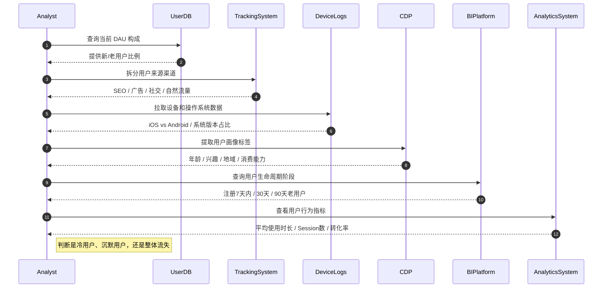

这一部分将陆陆续续汇集平常学习了解的*杂七杂八* 的内容和技能。

???+ abstract
    - 日本語: [=2% "2%"]{: .progress}
    - SQL: [=35% "35%"]{: .progress}
    - 商业化运营
    - ……

## Japanese
目标：N2； 计划周期：xx；
### Resources

## SQL  

### Tutorials & Materials
- [x] [14min SQL 教程]( https://www.bilibili.com/video/BV1bQxMehETa/?share_source=copy_web&vd_source=5571c774db3be3b200d58dee94d6f7a6 )

### Basic Operation
不区分大小写；
```SQL title="优先级" 
  SELECT col(s), [CASE WHEN THEN ELSE END] 
  FROM table_name(s)  
  [JOIN ... ON ...]  
  [WHERE condition]  
  [GROUP BY col]  
  [HAVING condition]  
  [ORDER BY col [ASC | DESC]] [CASE WHEN THEN ELSE END] 
  [LIMIT count]  
  [OFFSET count];  
  AND > OR 
```

<details>
  <summary>点击展开基础操作</summary>
    
    DDL 数据定义语言 create, drop, alter, show +对象类型+名字<br>
    DML 数据操作语言 insert, update, delete

    ``` SQL title="setup"
    create DATABASE db_name; # 创建数据库
    USE db_name; # 选择数据库
    drop DATABASE db_name; # 删除数据库

    create TABLE table_name(
        ID datatype PRIMARY KEY, # INT VARCHAR() CHAR() BOOL DATE
        col2 datatype, 
        ...);
    DROP TABLE table_name;

    alter table t1 RENAME TO t2;
    alter TABLE t1 ADD COLUMN col datatype;
    alter TABLE t1 DROP COLUMN col;
    alter TABLE t1 RENAME COLUMN col1 TO col2;
    alter TABLE t1 MODIFY COLUMN col datatype;
    alter TABLE t1 CHANGE col1 col2 datatype; # MySQL

    insert into table_name(col1, col2, ...)
    VALUES(Acol1, Acol2), (Bcol1, Bcol2); # 插入数据

    update table_name 
    SET col1 = value1, col2 = value2 #列名=值
    WHERE condition; # 更新符合条件的数据

    delete from t1 
    WHERE condition; # 删除符合条件的数据
    ```    


    DQL 数据查询 关键字, 模糊%_, 非空null, 去重distinct, 排序order by,  

    ``` SQL  title="fliter" 
    select * from table_name; # 查询整个表
    select col1, col2 from table_name; # 查询指定col
    select col from t1 LIMIT 10; # 限制查询行数

    select col 
    from t1 
    LIMIT 10 
    OFFSET 5; # 跳过5行再查询10行

    select col from t1 LIMIR 0,5; # Mysql分页查询第一页前五条

    select col1, col2 
    from t1
    where 分数 > 10 AND 班级<>'1'
    ORDER BY col1 DESC; 

    select col1, col2
    from t1
    where 姓名 LIKE '张%'；# %表示任意多个字符
    where 姓名 LIKE '张_'；# _表示任意一个字符
    where 分数 BETWEEN 10 AND 20; 
    where 分数 >= 10 AND 分数 <= 20; # 等价
    where 姓名 IN ('张三','张三丰'); # 简化OR，非连续范围
    where 姓名 NOT IN ('张三','张三丰');
    where col1 IS NOT NULL;

    ```
    
    聚合函数 count, sum, avg, max, min 注意括号<br>  
    分组查询 group by <br> 
    窗口函数<br> 
    函数名(...) OVER ( <br>  
    PARTITION BY ...  -- 按谁分组（可选）<br>   
    ORDER BY ...      -- 按什么顺序（可选） <br>  
    ROWS BETWEEN ...  -- 行范围（可选）<br>   
    )<br> 
    ```
     ROW_NUMBER()  给每组中每行编号，从 1 开始       
     RANK()        排名（有并列，跳号）      
     DENSE_RANK()  排名（有并列，不跳号）
     LAG(col)      取前一行的某列值（同组内）
     LEAD(col)     取后一行的某列值（同组内）     
    ```

    ``` SQL  title="calculate" 
    select ROUND(AVG(col1),1) col2 # 保留一位小数点并创建新列
    from t1
    GROUP BY col3
    HAVING col2 > 10; 

    select MAX(col1), MIN(col1), SUM(col1), COUNT(col) 

    select COUNT(DISTINCT col1) # 总行数
    select COUNT(DISTINCT col1) # 去重行数

    select DISTINCT col1
    from t1
    where col1 IS NOT NULL; # 非空

    ```

    

    ``` SQL  title="join"  
    select *
    from t1 # t1为左表
    JOIN t2 # t2为右表
    ON t1.col1 = t2.col1; # 等价于 using(col1)

    select t1.A, t1.B, t2.Y # 最后输出新表所含的列
    from t1
    inner JOIN t2 # 内连接，得到交集
    on t1.A = t2.X
    where t1.A > 10; 

    select t1.A, t1.B, t2.Y
    from t1
    left JOIN t2 # 左连接，得到左表行数
    right JOIN t2 # 右连接，得到右表行数，等价于左连接左右表位置互换
    full JOIN t2 # 全连接，得到并集，mySQL不可用
    on t1.A = t2.X 
    where t1.A > 10;
    ```

    子查询可以作为条件，使用运算符去判断。 运算符： > >= < <= = in

    ``` SQL  title="subquery"  
    select * from t1 where col1 IN (select col1 from t2);

    SELECT * 
    FROM dept t1, (SELECT * FROM emp WHERE emp.`join_date` > '2011-11-11') t2 # 子查询作为一张虚拟表
    WHERE t1.id = t2.dept_id; 
    
    SELECT * 
    FROM emp t1, dept t2 
    WHERE t1.`dept_id` = t2.`id` AND t1.`join_date` >  '2011-11-11' # 等价

    ```

    DCL 数据控制 管理用户、权限

    ``` SQL  title="manage"  
    create user 'username'@'host' identified by 'password';
    drop user 'username'@'host';

    show grants for 'username'@'host';
    grant 权限列表 on 数据库名.*(表名) to 'username'@'host';
    grant all on *.* to 'username'@'host';
    revoke 权限列表 on 数据库名.*(表名) from 'username'@'host';
    revoke update on 数据库名.表名 from 'username'@'host';
    ```
</details>

{==难点与易错点==}
???+ question
    1. **left join, right join, inner join, full join**  
        注意两个表的字段都会保留，当t1和t2中有同名字段，比如 id，结果中会显示两列id 
        左连接，为左表的所有行匹配右表行，没有匹配的行为NULL；右连接反之；  
        内连接，为两个表匹配行，交集；  
        全连接，为两个表匹配行并返回所有行，并集； 
    2. **cross join, self join**  
        cross join，笛卡尔积，生成所有组合； 
        ```
        select t1.A, t1.B, t2.Y
        from t1
        cross JOIN t2 

        select t1.A, t1.B, t2.Y
        from t1, t2 # 隐式内连接，等价于cross join

        ```

        self join，自身连接，并非一个语法，例如：  
        
        ```
        SELECT a.name AS employee, b.name AS manager  
        FROM employees a  
        LEFT JOIN employees b # 注意此处左右表都是employees
        ON a.manager_id = b.emp_id; # employees表至少有 emp_id, manager_id, name 字段
        ```
    3. **case when then else end**
        类似于if-else语句，例如： 
        ```
        
        SELECT name, dept_id, # 逗号
            CASE 
                WHEN dept_id = 10 THEN '销售部' # 注意缩进
                WHEN dept_id = 20 THEN '财务部'
                ELSE '未知部门'
            END AS dept_name #生成新列，else和as可选
        FROM employees;
        ``` 
    4. **重命名操作**  
       
       - 查询中临时修改表名和列名 `AS`，例如：  
         ```
         select e.col1 d.col2  
         from employee e
         left join department d
         on e.id = d.id;    
         select e.col1 as col2, d.col2 as col3...
         ``` 
       - 永久修改表名和列名 `RENAME TO`，例如：       
         ```  
         alter table employee rename to e;       
         alter table employee renamte column col1 to col2; 
         alter table employee change col1 col2 datatype; # MySQL
         
         ```   
 
    5. **WHERE 不能使用聚合函数**   

### Error Analysis
??? warning "Error"
    1. **外连接** 
      
        | id | name  | salary | managerId |
        | -- | ----- | ------ | --------- |
        | 1  | Joe   | 70000  | 3         |
        | 2  | Henry | 80000  | 4         |
        | 3  | Sam   | 60000  | null      |
        | 4  | Max   | 90000  | null      |
    
        ```
        select * from Employee a 
        left join Employee b on a.id = b.managerId; # 找下属
        ```
    
        output： 

        | id | name  | salary | managerId | id   | name  | salary | managerId |
        | -- | ----- | ------ | --------- | ---- | ----- | ------ | --------- |
        | 1  | Joe   | 70000  | 3         | null | null  | null   | null      |
        | 2  | Henry | 80000  | 4         | null | null  | null   | null      |
        | 3  | Sam   | 60000  | null      | 1    | Joe   | 70000  | 3         |
        | 4  | Max   | 90000  | null      | 2    | Henry | 80000  | 4         |

        ```
        select *from Employee a 
        left join Employee b on a.managerId = b.id; # 找经理
        ```
        output:  

         | id | name  | salary | managerId | id   | name | salary | managerId |
        | -- | ----- | ------ | --------- | ---- | ---- | ------ | --------- |
        | 1  | Joe   | 70000  | 3         | 3    | Sam  | 60000  | null      |
        | 2  | Henry | 80000  | 4         | 4    | Max  | 90000  | null      |
        | 3  | Sam   | 60000  | null      | null | null | null   | null      |
        | 4  | Max   | 90000  | null      | null | null | null   | null      |


## 商业化运营

[商业产品运营（广告方向）该怎么做？](https://www.zhihu.com/question/52108371/answer/264480245)

### Fundamental
1. 商业产品与用户产品不同的地方在于to b/to c。
2. 商业产品是以变现和赚钱为目的，用户产品是以用户增长和留存为目的。
3. 商业产品不排他，而用户产品是相对排他的。
4. 商业产品大部分是需要培训来使用户上手，而用户产品通常不需要培训用户就会使用。

### Concepts

#### index
| 指标名       | 全称                              | 用途/适用场景                                    |
| --------- | ------------------------------- | ------------------------------------------ |
| **SOV**   | Share of Voice                  | 品牌声音份额，衡量品牌曝光量在行业或平台中的占比，常用于**品牌建设**复盘与对标。 |
| **COV**   | Conversion Over View            | 广告转化率：转化次数 / 曝光次数，适合衡量**品牌广告的实际效果转化**。     |
| **SOI**   | Share of Interaction            | 用户互动占比，适合衡量**内容型广告**或社媒传播互动（点赞、评论、转发等）的表现。 |
| **ROAS**  | Return on Ad Spend              | 每1元广告费带来的收入，精细化衡量**电商类效果广告效率**。            |
| **CPO**   | Cost per Order                  | 每笔订单的平均获客成本，适用于有“下单”行为的广告主（电商、外卖、旅游等）。     |
| **LTV**   | Lifetime Value                  | 单个用户在生命周期内贡献的总收入，结合CAC评估**长期用户价值与投放回报**。   |
| **CAC**   | Customer Acquisition Cost       | 获取一个新客户的平均花费（营销+运营+折扣等），可与LTV对比，优化投放策略。    |
| **CTR**   | Click-Through Rate              | 点击率：点击量 / 展示量，基础曝光转化漏斗指标。                  |
| **CVR**   | Conversion Rate                 | 转化率：转化量 / 点击量，常用于评估**广告素材或落地页的表现**。        |
| **DAU**   | Daily Active Users              | 日活用户数，衡量平台/APP活跃度，是**增长与留存**的基础指标。         |
| **GMV**   | Gross Merchandise Volume        | 商品交易总额，不扣除退款/成本，常用于**电商、直播带货、平台类**业务。      |
| **ROI**   | Return on Investment            | 投资回报率，通用财务/投放效率指标（利润/投入成本），更全面反映投资效果。      |
| **PUR**   | Pay Users Rate                  | 付费率：付费用户数 / 活跃用户数，反映**变现能力或产品吸金力**。        |
| **ARPU**  | Average Revenue per User        | 每用户平均收入，常用于**游戏、SaaS、内容平台**等订阅/增值模型分析。     |
| **ARPPU** | Average Revenue per Paying User | 每个**付费用户**的平均贡献收入，反映**用户质量与消费能力**。         |


#### AARRR

| 阶段              | 主要指标   | 常见运营手段/工具             |
| --------------- | ------ | --------------------- |
| **Acquisition** | 新用户获取  | SEO、信息流广告、社媒推广、联合运营   |
| **Activation**  | 首次关键行为 | 引导体验、注册激励、关键路径优化      |
| **Retention**   | 留存率    | 用户分层运营、Push/消息触达、日常活动 |
| **Revenue**     | 收入变现   | 提升ARPU、设计付费路径、付费节奏引导  |
| **Referral**    | 用户裂变   | 邀请有礼、任务制裂变、社群分享等      |


#### Ad 

| 模式       | 全称                   | 计费逻辑说明                  | 适合场景 / 特点                          |
| -------- | -------------------- | ----------------------- | ---------------------------------- |
| **CPC**  | Cost Per Click       | 用户每点击一次广告计费             | 效果导向、跳转类广告（如落地页、电商商品详情页）           |
| **CPM**  | Cost Per Mille       | 每1000次展示计费              | 打声量、品牌曝光、产品发布会等需**大规模可见**的场景       |
| **CPT**  | Cost Per Time        | 固定时间段资源买断（如首页开屏）        | 头部资源、活动大促、明星代言/开屏、平台日历抢占           |
| **CPA**  | Cost Per Action      | 用户完成转化行为后计费（如注册、下单）     | 电商、App注册、线索收集类场景（通常效果投放核心指标）       |
| **CPI**  | Cost Per Install     | 用户完成App安装后计费            | 应用分发、工具类/游戏类App推广等                 |
| **CPS**  | Cost Per Sale        | 按照实际**成交金额**来付费         | 联盟营销、分销返佣类场景，平台广告主最喜欢“无风险投放”的方式    |
| **CPP**  | Cost Per Purchase    | 按每次交易笔数计费               | 电商交易广告，适合**低客单价高频购买**场景            |
| **OCPC** | Optimized CPC        | 转化优化版CPC，结合机器学习智能出价     | 高预算/多数据/成熟账户投放，**追求高ROI**型投放策略     |
| **CPUV** | Cost Per Unique View | 每个“唯一用户”展示一次计费          | 防止重复轰炸用户，提升用户体验，常见于品牌预算控制策略        |
| **CPV**  | Cost Per View        | 每次视频完整播放（或播放超X秒）计费      | 视频广告（如抖音、YouTube），用于评估视频吸引力和前端传播效率 |
| **vCPM** | Viewable CPM         | 仅展示“可视范围”内的广告才计费（非滑过去的） | 品牌主追求真实曝光，防止“虚假展示”作弊，**更真实的CPM**   |

#### data theories
| 名称         | 核心解释                | 实战举例                           | 如何避免                            |
| ---------- | ------------------- | ------------------------------ | ------------------------------- |
| **辛普森悖论**  | 总体趋势与分组趋势相反         | 总ROI涨了？其实是**预算倾斜**到高转化渠道了，其他在掉 | 做分组（渠道、地域、时间段）分析，建立**对照面板**     |
| **幸存者偏差**  | 只分析成功样本，忽略失败群体      | 看ROI只分析“下单用户”，忽略99%不买的人        | 建立**完整样本视角**，分析**流失漏斗**         |
| **自选择偏差**  | 样本因自身行为特征而非因变量干扰    | 点击广告的人本来就对产品有兴趣 → 看起来广告超有效     | 采用**随机分组设计**（A/B Test）、对照人群对比   |
| **安慰剂效应**  | 预期影响行为结果            | 新广告页面用了新设计 → 用户预期高 → 点击率提升     | 做**双盲A/B测试**，控制用户对设计的心理影响       |
| **回归均值**   | 极端表现后，自然回落趋于平均      | 某条素材CTR爆表，下周自然掉 → 并不一定是它“失效”了  | 看**趋势线+周期分析**，拆分短期波动与长期趋势       |
| **多重比较问题** | 多次测试容易出现伪显著         | 跑100个素材测试，总有几个P<0.05，但可能是巧合    | 控制显著性：Bonferroni / FDR校正 / 降维分析 |
| **指标替代谬误** | 错误用替代指标判断目标         | 用点击量当“兴趣”，用注册数代表“价值”           | 明确**真正业务目标**，慎用代理指标             |
| **滞后指标陷阱** | 有些关键行为反映较晚，初期数据误导决策 | 用户看广告第3天才下单 → 前两天数据看起来转化很低     | 用**滑窗+生命周期模型**建模，考虑用户“转化周期”     |
| **漏斗解释错误** | 只看中下层数据，不考虑上层质量     | CVR很高 → 但其实曝光很差 → 总转化依旧低       | 建立**完整漏斗数据追踪机制**，不只盯着一个指标       |

#### user




### Examples

??? note "问答思考"
    - 飞书文档某一天流量下滑 20%，你从哪些维度分析？  
        首先从用户维度拆出是数量（用户量）还是质量（使用深度）的问题，再逐步排查是来源维度（如特定的引流入口中断）、渠道维度（某个客户端入口异常）还是功能或者技术维度的问题，或者有可能是外部事件导致的异常。

    - DAU下降排查全景图
        ```mermaid 
        sequenceDiagram
        autonumber
        User->>Analyst: 提出 DAU 下滑 20%
        Analyst->>DataSystem: 校验数据准确性
        DataSystem-->>Analyst: 埋点/埋点丢失/周期问题？

        Analyst->>ProductTeam: 是否有产品崩溃/功能不可用？
        ProductTeam-->>Analyst: 登陆异常 / push失败 / App闪退

        Analyst->>UserDataPlatform: 拆分 DAU 构成
        UserDataPlatform-->>Analyst: 新老用户 / 地域 / 设备 / 渠道占比

        Analyst->>ContentOps: 内容推荐策略有变？
        ContentOps-->>Analyst: 热门内容下架？算法更新？KOL掉线？

        Analyst->>MarketingTeam: 是否有营销暂停？
        MarketingTeam-->>Analyst: 推广断投？渠道问题？外部竞品活动？

        Analyst->>ComplianceTeam: 是否遇到政策/平台限制？
        ComplianceTeam-->>Analyst: 封禁风险 / 舆情事件

        Analyst->>Analyst: 汇总所有维度 + 拆趋势曲线 + 拆小时级波动
        ```

    - 理解抖音电商广告产品矩阵（DOU+ / 品牌广告 / 竞价广告等）的协同逻辑  
       抖音电商广告其实形成了一个协同矩阵。  
       DOU+主要是用来做**冷启、测试素材或者扩大自然量级**，它覆盖面广、成本低，但不精准；  
       竞价广告像FEED投放（信息流）则更适合**拉新和转化**，它依赖算法精准投人群，适合控ROI；  
       品牌广告，比如TopView或者超级首位，适合品牌打**声量**，在节日节点提升整体认知度。  
       所以这三类广告是“冷启–转化–品牌建设”的协同路径，在多目标投放策略中各自发挥作用。

    - GMV提升30%，如何排除自然流量干扰？   
       一是技术层面，用归因数据判断GMV是来源于广告还是自然流量，比如通过短链跳转、UTM追踪、抖音后台的“广告GMV”指标做数据拆分；  
       二是对照实验，如果同时期未投放广告的产品GMV持平，而投放产品涨幅显著，说明广告贡献大；  
       同时也可以看“点击/浏览/投后新增粉丝”的指标，看用户是否是因广告路径进来的。
       这样可以最大程度排除自然流量影响，还原广告本身带来的GMV价值。

    - 分析 TikTok Shop 与抖音电商的生态差异  
       TikTok Shop跟抖音电商在逻辑上是一样的，但在发展阶段上有很大差异。抖音电商生态已经非常成熟，用户对直播带货、短视频种草都很习惯，达人、商家、平台规则也非常明确；  
       而TikTok Shop在很多海外市场还处于冷启阶段，用户购物心智没那么强，达人种草的路径还不完善，更多靠平台激励、跨境商品和内容驱动起量。  
       商家生态方面，抖音以本地品牌和强私域为主，而TikTok Shop还在培养本地商家，跨境商家是主力。  
       所以TikTok Shop还处于教育市场阶段，需要更强的内容运营、投放协同和商家服务。