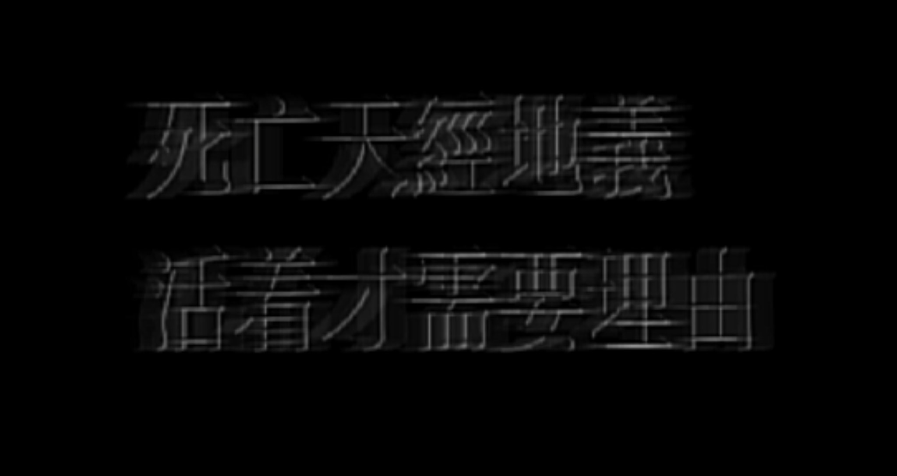

## For My Eyes Only
    
    20250629

    我还是想当一只猫，一棵树，一朝菌蟪蛄。  
--- 
    20250619
    
    昨天晚上，应该说是凌晨，也许是三点、也许是四点，在半梦半醒之间，不安的梦境引起了心脏的揪痛。  
    梦里我的角色辗转，就像喜剧之王里可悲的龙套主角，需要在一分钟内变换十几个角色。我是扭曲的，一下哭，一下笑，一下凶狠，一下懦弱，始终不变的是一种孤独的悲哀。不被选择的心酸。 
     
    现实里我的心脏的收缩的疼痛，激起泪腺的反应。我感受到黏腻的眼泪从眼眶开始了它的轨迹，沿着面颊湿漉漉地滚下去。而理智竟然残存，提醒我不要让眼泪沾湿枕头——因为是刚洗晒过的。我闻到枕头上干燥清淡的洗衣凝珠花香，抬起手指贴到耳边，尝试接住一趟趟冰凉的泪珠。 

    双目紧紧闭着，心脏酸疼，一阵又一阵。梦里有人在大声呼喊、斥责、叫骂……在我看来只是徒劳地发疯。是我在做、是我在看。 

    我既是上帝，又是演员；既是主角，也是群演；既是患者，又是医生。  
    睡醒之后一切干干净净。枕头依然干燥芬香。  

    镜子里眼睛稍微红肿，告诉我，这不是一个梦中梦。 
---
    #抛开事实不谈 20250607
   
    每个人都知道的一个终点，每个生物终将到达之处，它一定是一种必然了。
    天经地义即描述这种必然。  

    那么，它的反面岂非一种非必然。  

    而这两位之中，我们所能选择的又是什么呢？ 

    显然不能决定如何生，或许能够决定如何死，或许能够决定如何活。

    倘若我可以盘算今天是要好好地活还是一般坏地活，那我为何无法选择20岁还是80岁走向那个必然呢？  

    大部分人类似乎认同，最好尽量延长这趟旅程。  

    可是，不选“马拉松”而选“短跑”，难道是应当受责备的吗？ 

    大部分人类似乎认同这个情境下的马拉松优于短跑，还认同，选择短跑的人是无法忍受马拉松——厌烦、倦怠、失望、茫然——总是由于意志脆弱、耐力薄弱。即使大家往往不否认马拉松本身有缺陷。  

    是否存在证据显示，有的个体是纯粹地极度地向往那个终点而选择短跑呢？  

    为什么这种行为总是引来各种声音，而选择马拉松则是稀松平常呢？ 

    这世界给予后者丰厚的附加分。  

    对了，准备包也比前者充足得多，比如身世地位、人际关系以及生理心理机制带来的思想情绪……这些东西促使你无法中途离开马拉松赛场。不过，人人都清楚自己的准备包与别人不相同。  

    乱了。  
    毕竟无数的哲学家思想家教育家先贤早已无数次讨论过这些东西的内涵。  

---

## Or Perhaps, For Yours
    
    20250221  

    有一个晚上，一个寻常的夜晚，我似乎忽然明白了爱是什么。  
    我终于能够给我所认同的“爱”下一个定义。  

    如果一个人爱另一个人，那么，对方的存在，将是他坚持生存的不可动摇的原因。  

    因为我爱你，当我想起你，就觉得应该在这破烂的世界，再坚持一天。  

    这也许是我害怕孤单与痛苦，也许是我害怕你会为我的缘故而孤单和痛苦，但最重要的是，爱带来了牵挂，也带来了希望。  

    爱使我们相信，我们终究能够越过艰难的过去与现在，在未来紧紧相拥。  

    爱，给人生存的勇气。  
---     
    20241030  

    喂——  
    你好吗——  
    回声荡漾在山岚中，叫风吹散了。  

--- 

